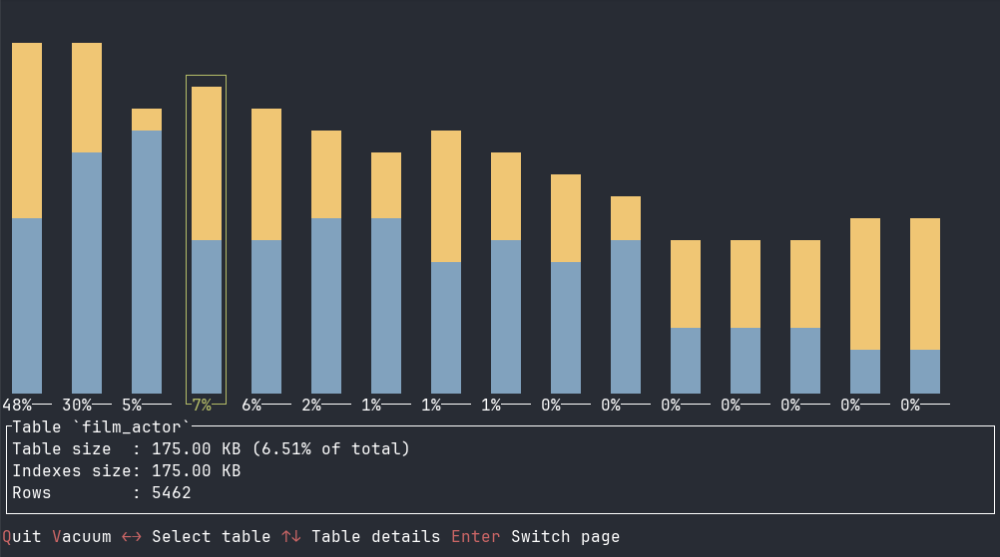
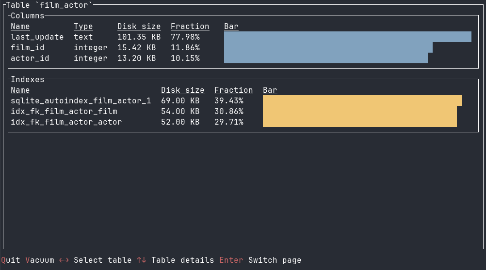
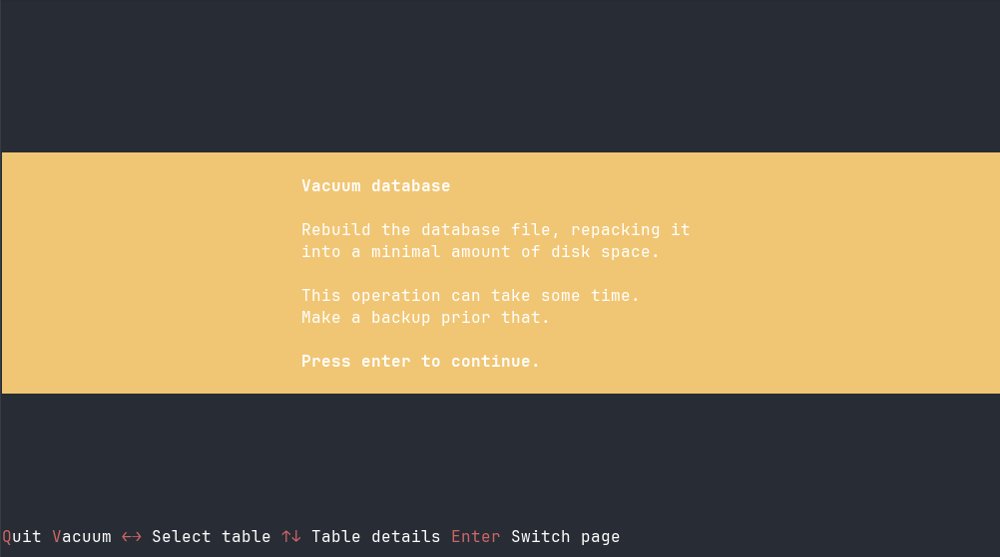

# Vinolite

Analyze SQLite databases space use per table, column and index.

<p align="center">
    
    Tables size chart
</p>

<p align="center">
    
    Table details
</p>

<p align="center">
    
    Vacuum warning message
</p>

## Installation

```bash
git clone https://github.com/krypt0nn/vinolite
cd vinolite
cargo install --path .
```

Author: [Nikita Podvirnyi](https://github.com/krypt0nn)\
Licensed under [GPL-3.0](LICENSE)
